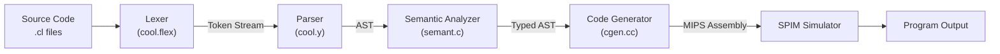
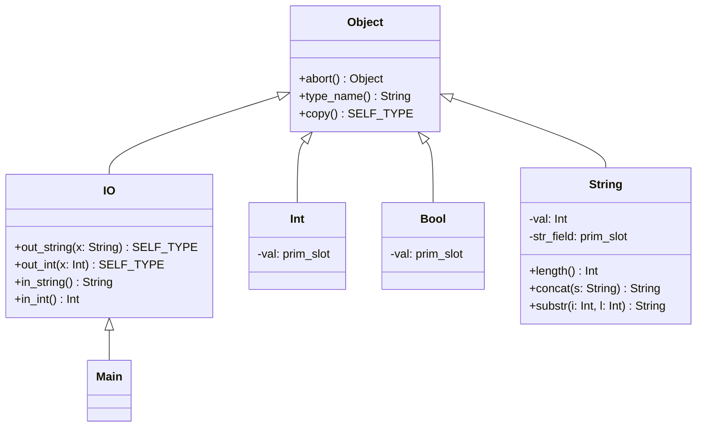

# 🧊 COOL Compiler

A full compiler for the **Classroom Object-Oriented Language (COOL)**, built as part of Stanford's CS143 Compilers course. The compiler takes COOL source programs through all four phases of compilation — lexical analysis, parsing, semantic analysis, and code generation — producing **MIPS assembly** that runs on the SPIM simulator.

> COOL is a small but expressive language with classes, inheritance, static typing, automatic memory management, and other hallmarks of modern object-oriented languages.

---

## Table of Contents

- [Overview](#overview)
- [Language Features](#language-features)
- [Compiler Pipeline](#compiler-pipeline)
- [Project Structure](#project-structure)
- [Getting Started](#getting-started)
  - [Prerequisites](#prerequisites)
  - [Building the Compiler](#building-the-compiler)
  - [Running a COOL Program](#running-a-cool-program)
- [Compiler Phases in Detail](#compiler-phases-in-detail)
  - [Phase 1 — Lexical Analysis](#phase-1--lexical-analysis)
  - [Phase 2 — Parsing](#phase-2--parsing)
  - [Phase 3 — Semantic Analysis](#phase-3--semantic-analysis)
  - [Phase 4 — Code Generation](#phase-4--code-generation)
- [Example Programs](#example-programs)
- [Architecture](#architecture)
- [Documentation & References](#documentation--references)
- [License](#license)

---

## Overview

```
┌──────────┐     ┌────────┐     ┌──────────┐     ┌──────────┐     ┌──────────┐
│  Source   │────▶│ Lexer  │────▶│  Parser  │────▶│ Semantic │────▶│   Code   │
│  (.cl)   │     │ (flex) │     │ (bison)  │     │ Analyzer │     │Generator │
└──────────┘     └────────┘     └──────────┘     └──────────┘     └──────────┘
                  Tokens          AST             Typed AST         MIPS .s
```

The compiler is implemented in **C++** using industry-standard tools:

| Phase | Tool / Implementation | Output |
|-------|----------------------|--------|
| Lexical Analysis | Flex (`cool.flex`) | Token stream |
| Parsing | Bison (`cool.y`) | Abstract Syntax Tree |
| Semantic Analysis | Hand-written C++ (`semant.c`) | Type-annotated AST |
| Code Generation | C++ (`cgen.cc`) | MIPS assembly (`.s`) |

---

## Language Features

COOL supports a rich set of features for a teaching language:

- **Classes and Inheritance** — single inheritance with `inherits` keyword
- **Static Typing** with type inference via `SELF_TYPE`
- **Dynamic Dispatch** — method calls resolved at runtime
- **Static Dispatch** — explicit superclass method calls with `@`
- **Pattern Matching** — `case` expressions with branch types
- **Let Expressions** — local variable bindings
- **Loops and Conditionals** — `while/loop/pool` and `if/then/else/fi`
- **Automatic Memory Management** — garbage collected
- **Built-in Classes** — `Object`, `IO`, `String`, `Int`, `Bool`
- **String and Integer Constants**
- **Boolean Logic** — `not`, comparisons (`<`, `<=`, `=`)
- **Arithmetic** — `+`, `-`, `*`, `/`, `~` (negation)

### Hello World

```cool
class Main inherits IO {
   main(): SELF_TYPE {
      out_string("Hello, World.\n")
   };
};
```

### A More Interesting Example

```cool
class Complex inherits IO {
    x : Int;
    y : Int;

    init(a : Int, b : Int) : Complex {
        {
            x = a;
            y = b;
            self;
        }
    };

    reflect_0() : Complex {
        {
            x = ~x;
            y = ~y;
            self;
        }
    };
};
```

---

## Compiler Pipeline



Each phase is implemented as a **standalone executable** that communicates via Unix pipes, allowing you to mix-and-match your implementations with the reference compiler's components:

```bash
# Using the pipeline script (mycoolc)
./mycoolc program.cl

# Or manually piping phases
./lexer program.cl | ./parser | ./semant | ./cgen > program.s

# Running the output
spim -file program.s
```

---

## Project Structure

```
compiler/
├── cool.flex                  # ✏️  Lexer specification (Flex)
├── cool.y                     # ✏️  Parser grammar (Bison)
├── semant.c                   # ✏️  Semantic analyzer implementation
├── cgen.cc                    # ✏️  Code generator (WIP)
│
├── assignments/               # Assignment skeletons with Makefiles
│   ├── PA1/                   #   Stack machine exercise (intro to COOL)
│   ├── PA2/                   #   Lexical analysis
│   ├── PA3/                   #   Parsing
│   ├── PA4/                   #   Semantic analysis
│   └── PA5/                   #   Code generation
│
├── src/                       # Shared source files per assignment phase
│   ├── PA1/                   #   (empty — PA1 is pure COOL)
│   ├── PA2/                   #   lextest.cc, utilities, string tables
│   ├── PA3/                   #   cool-tree.cc, parser driver, token lexer
│   ├── PA4/                   #   AST parser, semant driver, symbol table
│   └── PA5/                   #   AST parser, cgen driver
│
├── include/                   # Header files organized by assignment phase
│   ├── PA2/ … PA5/
│
├── bin/                       # Compiler toolchain executables
│   ├── coolc                  #   Full reference compiler
│   ├── lexer                  #   Reference lexer
│   ├── parser                 #   Reference parser
│   ├── semant                 #   Reference semantic analyzer
│   ├── cgen                   #   Reference code generator
│   ├── spim                   #   MIPS simulator
│   └── xspim                  #   SPIM with GUI
│
├── lib/                       # Runtime libraries
│   ├── trap.handler           #   SPIM trap handler for COOL runtime
│   ├── java-cup-11a.jar       #   Java CUP parser generator (Java edition)
│   └── jlex.jar               #   JLex lexer generator (Java edition)
│
├── etc/
│   └── link-object            # Linker script for platform binaries
│
├── examples/                  # Example COOL programs
│   ├── hello_world.cl
│   ├── arith.cl, complex.cl, palindrome.cl, primes.cl, ...
│   └── README
│
├── docs/                      # Documentation and diagrams
│   ├── Thesis_COOL.pdf        #   COOL language thesis
│   ├── Object.png             #   Object layout diagram
│   ├── Pet_AST.png            #   Example AST visualization
│   ├── cool_grammer_pic.png   #   Grammar visualization
│   ├── stack_layout (1).png   #   Runtime stack layout
│   ├── view_execution_mips.png        # MIPS execution flow
│   ├── view_object_code.png           # Object code structure
│   └── view_object__dispatch_creation.png  # Dispatch table creation
│
├── handouts/                  # Course handouts and references
│   ├── cool-manual.pdf        #   COOL language reference manual
│   ├── cool-tour.pdf          #   A Tour of the COOL compiler
│   ├── PA1.pdf … PA5.pdf      #   Assignment specifications
│   └── extra-credit.pdf
│
├── bison_manual.pdf           # GNU Bison reference manual
├── coolaid-manual.pdf         # CoolAid debugging tool manual
└── fourier_motzkin.pdf        # Fourier-Motzkin elimination (theory)
```

---

## Getting Started

### Prerequisites

- **Linux** (i686/x86 — the provided binaries target this architecture)
- **g++** — GNU C++ compiler
- **flex** — lexical analyzer generator
- **bison** — parser generator
- **make** — build automation
- **spim** — MIPS simulator (included in `bin/`)

### Building the Compiler

Each assignment phase can be built independently from its `assignments/PA*` directory:

```bash
# Build the lexer (PA2)
cd assignments/PA2
make lexer

# Build the parser (PA3)
cd assignments/PA3
make parser

# Build the semantic analyzer (PA4)
cd assignments/PA4
make semant

# Build the code generator (PA5)
cd assignments/PA5
make cgen
```

### Running a COOL Program

**Compile** a COOL source file to MIPS assembly:

```bash
# Using the full reference compiler
./bin/coolc examples/hello_world.cl

# Or using your own compiler pipeline
./assignments/PA5/mycoolc examples/hello_world.cl
```

**Execute** the generated assembly on SPIM:

```bash
./bin/spim -file hello_world.s
```

**Expected output:**
```
COOL program successfully executed
Hello, World.
```

---

## Compiler Phases in Detail

### Phase 1 — Lexical Analysis

**File:** [`cool.flex`](cool.flex)  
**Tool:** Flex

The lexer tokenizes COOL source code into a stream of tokens. Key implementation details:

- **Keyword recognition** — case-insensitive matching for 17 keywords (`class`, `inherits`, `if`, `then`, `fi`, `while`, `loop`, `pool`, `let`, `case`, `esac`, `of`, `new`, `isvoid`, `in`, `not`, `else`)
- **Nested comments** — `(* ... *)` with proper nesting via a counter; single-line `--` comments
- **String constants** — handles escape sequences (`\n`, `\t`, `\b`, `\f`), embedded newlines, and EOF-in-string errors
- **Type vs Object IDs** — uppercase-initial identifiers are `TYPEID`, lowercase are `OBJECTID`
- **Boolean constants** — `true`/`false` must begin with lowercase to be boolean literals
- **Error recovery** — meaningful error messages for unmatched `*)`, EOF in comments, and EOF in strings

### Phase 2 — Parsing

**File:** [`cool.y`](cool.y)  
**Tool:** Bison

The parser constructs an Abstract Syntax Tree (AST) from the token stream. Key features:

- **Complete COOL grammar** — all language constructs including classes, methods, attributes, expressions
- **Operator precedence** — correctly handles `=`, `<`, `<=`, `+`, `-`, `*`, `/`, `isvoid`, `~`, `@`, `.` with proper associativity
- **Error recovery** — `error` productions in class, feature, expression list, and let-body rules for graceful degradation
- **AST construction** — uses the COOL tree package to build typed AST nodes (`class_`, `method`, `attr`, `assign`, `dispatch`, `cond`, `loop`, `let`, `typcase`, `block`, etc.)
- **Let sugar** — multi-binding `let` desugared into nested single-binding `let` nodes

### Phase 3 — Semantic Analysis

**File:** [`semant.c`](semant.c)  
**Lines:** ~984 lines of type-checking logic

The semantic analyzer performs comprehensive static analysis:

**Class Hierarchy Validation:**
- Detects redefined classes and redefinitions of basic classes (`SELF_TYPE`)
- Ensures all parent classes exist
- Prevents inheritance from `Int`, `Bool`, `String`, `SELF_TYPE`
- Detects inheritance cycles
- Verifies `Main` class is defined

**Type Checking (per the COOL type rules):**
- **Method type checking** — validates formal parameter types, return types, and method body conformance
- **Method override checking** — ensures redefined methods have identical signatures
- **Attribute type checking** — validates initializer conformance to declared types
- **Expression type checking** — full implementation for all COOL expressions:
  - `assign`, `dispatch`, `static_dispatch`, `cond` (if-then-else), `loop`, `typcase` (case), `block`, `let`
  - Arithmetic (`+`, `-`, `*`, `/`) — enforces `Int` operands
  - Comparisons (`<`, `<=`, `=`) — type compatibility checks
  - `isvoid`, `not`, `new`, `~` (negation)

**Type Environment:**
- Scoped symbol table (`SymbolTable`) for object environment
- Global method environment `M(C, f)` with inheritance-chain lookup
- `SELF_TYPE` handling throughout the type system
- Least Upper Bound (`cls_join`) for `if` and `case` branches

**Built-in Classes:**
- Installs `Object`, `IO`, `Int`, `Bool`, `String` with all their methods

### Phase 4 — Code Generation

**File:** [`cgen.cc`](cgen.cc)  
**Status:** 🚧 Work in progress

Generates MIPS assembly targeting the SPIM simulator. The reference implementation handles:
- Class prototypes and dispatch tables
- Object layout with inherited attributes
- Method dispatch (static and dynamic)
- Stack frame management
- Runtime type information

---

## Example Programs

The [`examples/`](examples/) directory contains programs that showcase various COOL features:

| Program | Description |
|---------|-------------|
| `hello_world.cl` | Classic first program |
| `arith.cl` | Arithmetic operations in COOL |
| `atoi.cl` / `atoi_test.cl` | String-to-integer conversion (C `atoi` in COOL) |
| `complex.cl` | Complex number class with method chaining |
| `palindrome.cl` | Recursive palindrome checker |
| `list.cl` / `sort_list.cl` | Linked list with inheritance and dynamic dispatch |
| `book_list.cl` | Static dispatch and case statement demo |
| `primes.cl` | Prime number generator |
| `cells.cl` | 1D cellular automaton |
| `graph.cl` | Weighted directed graph reader |
| `life.cl` | Conway's Game of Life |
| `lam.cl` | Lambda calculus interpreter |
| `io.cl` | IO class usage examples |
| `hairyscary.cl` | Obscure language feature stress test |

Run any example:

```bash
./bin/coolc examples/palindrome.cl
./bin/spim -file palindrome.s
```

---

## Architecture

### COOL Object Layout

Every COOL object in memory follows this layout:

```
┌─────────────────────────┐
│  Class Tag (Int)        │  ← identifies the class at runtime
├─────────────────────────┤
│  Object Size (Int)      │  ← size in 32-bit words
├─────────────────────────┤
│  Dispatch Pointer       │  ← pointer to the dispatch table
├─────────────────────────┤
│  Attribute 1            │  ← inherited attributes first
│  Attribute 2            │
│  ...                    │
│  Attribute N            │  ← then own attributes
└─────────────────────────┘
```

### Dispatch Table

```
┌─────────────────────────┐
│  method_1 address       │  ← inherited methods
│  method_2 address       │
│  ...                    │
│  method_N address       │  ← overridden/new methods
└─────────────────────────┘
```

### Class Hierarchy



---

## Documentation & References

### In This Repository

| Document | Location | Description |
|----------|----------|-------------|
| COOL Language Manual | [`handouts/cool-manual.pdf`](handouts/cool-manual.pdf) | Complete language specification |
| A Tour of COOL | [`handouts/cool-tour.pdf`](handouts/cool-tour.pdf) | Compiler architecture overview |
| COOL Thesis | [`docs/Thesis_COOL.pdf`](docs/Thesis_COOL.pdf) | Academic thesis on the COOL language |
| Bison Manual | [`bison_manual.pdf`](bison_manual.pdf) | GNU Bison parser generator reference |
| CoolAid Manual | [`coolaid-manual.pdf`](coolaid-manual.pdf) | CoolAid debugging tool guide |
| PA1–PA5 Specs | [`handouts/PA1.pdf`](handouts/PA1.pdf) … [`PA5.pdf`](handouts/PA5.pdf) | Assignment specifications |

### Diagrams (in `docs/`)

The `docs/` folder contains visual references for understanding the compiler internals:

- **`Object.png`** — COOL object memory layout
- **`Pet_AST.png`** — Example AST visualization
- **`cool_grammer_pic.png`** — COOL grammar structure
- **`stack_layout (1).png`** — Runtime stack frame layout
- **`view_execution_mips.png`** — MIPS execution flow
- **`view_object_code.png`** — Generated object code structure
- **`view_object__dispatch_creation.png`** — Dispatch table construction

### External References

- [Stanford CS143 Course Page](https://web.stanford.edu/class/cs143/)
- [The Cool Reference Manual](https://theory.stanford.edu/~aiken/software/cool/cool-manual.pdf)
- [SPIM MIPS Simulator](http://spimsimulator.sourceforge.net/)

---

## License

This project is based on the Stanford CS143 Compilers course materials. The course infrastructure is copyright © The Regents of the University of California. The student implementations (`cool.flex`, `cool.y`, `semant.c`, `cgen.cc`) are original work.

